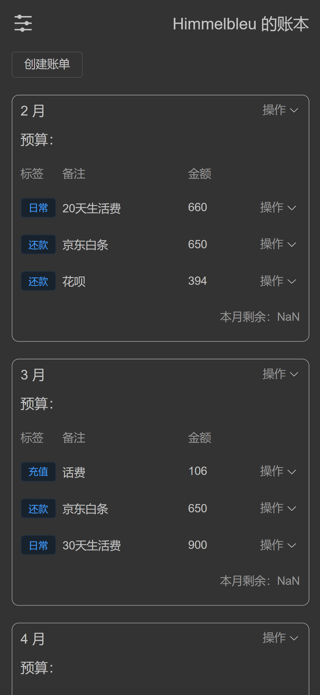

# 项目说明

一个规划自己每月开支的账单小程序。设定每月可用支出，记录每月每笔开销，下月根据上月所预支开销，计算每月可用实际支出。

# 功能介绍

## 添加账单

你可以在本年中添加一个账单，一个账单对应一个月份，且不可以重复创建账单。添加账单时你可以选择该账单是几年的几月份的账单，还可以指定本月预算是多少。

根据年份可以筛选账单，账单展示的范围是 1~12 月。

## 添加支出

你可以在某个账单中添加一项支出，支出必须填写花费的金额，标签、备注选填。

## 修改账本信息

1. 修改账本标题
2. 修改个人图标

## 管理账本数据

1. 导出数据
2. 导入数据
